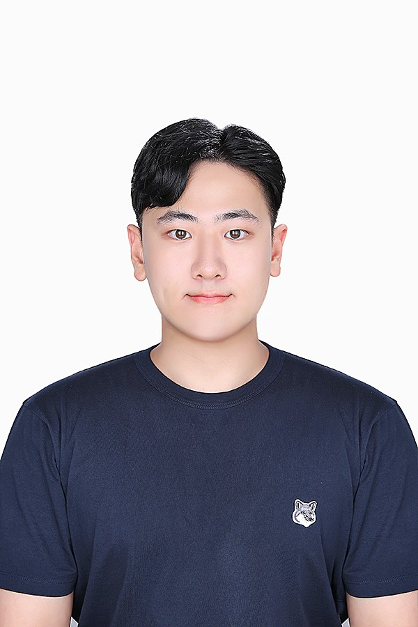
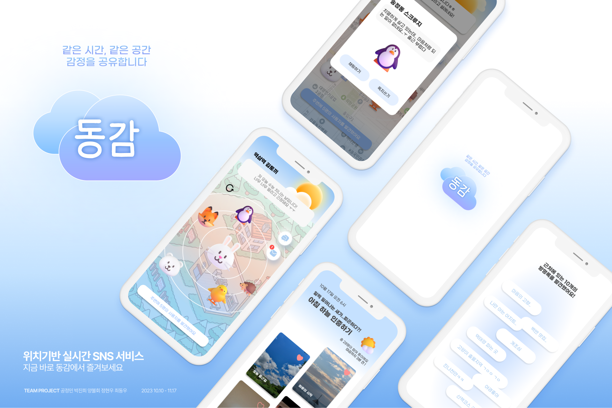
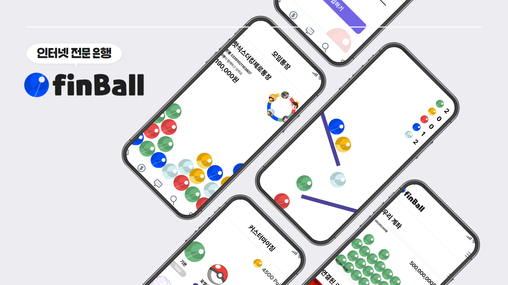
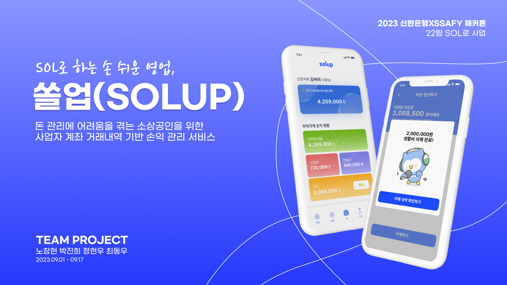
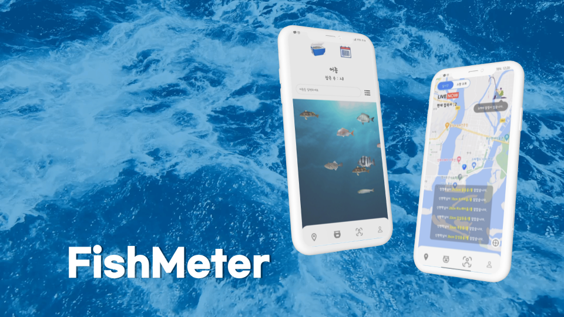

## Hi there 👋

## 💻 Tech Stack

### 📱 Frontend

  
  &nbsp;
  
  &nbsp;
  

### ⚙️ Backend & Database

  
  &nbsp;
  
  &nbsp;
  

### 🛠️ Tools

  
  
  &nbsp;
  

### Statistics

  
  
  

  

<html><head>
    <title>백엔드 개발자 정현우 포트폴리오입니다.</title>
    <meta charset="utf-8">
    <meta name="viewport" content="width=device-width, initial-scale=1, user-scalable=no">
    <link rel="stylesheet" href="assets/css/main.css">
  </head>
  <body class="">
    <!-- Header -->
    <section id="header">
      <header>
        
        <h1 id="logo"><a href="#" style="-webkit-tap-highlight-color: rgba(0, 0, 0, 0);">JungHyunWoo</a></h1>
      </header>
      <nav id="nav">
        <ul>
          <li><a href="#one" class="scrolly active" style="-webkit-tap-highlight-color: rgba(0, 0, 0, 0);">Introduction</a></li>
          <li><a href="#two" class="scrolly" style="-webkit-tap-highlight-color: rgba(0, 0, 0, 0);">SkillSet</a></li>
          <li><a href="#three" class="scrolly" style="-webkit-tap-highlight-color: rgba(0, 0, 0, 0);">Portfolio</a></li>
          <li><a href="#four" class="scrolly" style="-webkit-tap-highlight-color: rgba(0, 0, 0, 0);">Awards</a></li>  
          <li><a href="#five" class="scrolly" style="-webkit-tap-highlight-color: rgba(0, 0, 0, 0);">Certification</a></li>
          <li><a href="#six" class="scrolly" style="-webkit-tap-highlight-color: rgba(0, 0, 0, 0);">Contack</a></li>
        </ul>
      </nav>
    </section>

    <!-- Wrapper -->
    

      <!-- Main -->
      

        <!-- One -->
        <section id="one" class="">
          

            <header class="major">
              <h2>Introduction</h2>
              <h3>
                안녕하세요.&nbsp;  
                저는 신입 백엔드 개발자 
                정현우입니다.
              </h3>
            </header>
            

              
<h2>"팔굽혀펴기 스트릭 1800일"</h2>
              꾸준하게 공부하고 발전하는 것을 좋아합니다.
               
              새로운 기술을 적용하거나 로직을 변경하여 성능을 개선하는 것을
              좋아합니다. 
              현재 신입 백엔드 개발자로 구직중입니다. 
            

            

            <header class="major">
              <h4>Overall Experiences</h4>
              <h5>인턴</h5>
              
2024.08 ~ 2024.10

              <p5>
                인턴 근무를 통해 업무 프로세스에 대한 이해도를 높이고 홈페이지 및 관리자 페이지 프론트엔드와 백엔드 개발을 통해 직무경험을 쌓았습니다.
              </p5>
              

              <h5>EPSON with LIKELION 해커톤</h5>
              
2024.06

              <p5>
                EPSON 해커톤 본선에 참가했습니다.
                EPSON의 프린트 API를 활용하여 프린트 및 스캔 기능을 구현하였습니다.
                모국어 기반의 한국어 학습지 생성 서비스를 개발했습니다.
              </p5>
              

              <h5>삼성 청년 소프트웨어 아카데미(SSAFY)</h5>
              
2023.01. - 2023.12.

              <p5>
                운영체제, 알고리즘, 자료구조 등 개발에 대해 조금 더 배워보고
                싶어서 SSAFY에 입과하였습니다.&nbsp; 코딩을 하면서 오류를
                고민하여 문제 해결하는 데에 있어서 성취감과 흥미를 느껴 개발자로
                진로를 정하게 되었습니다.
              </p5>
              

              <h5>신한은행 SSAFY 해커톤</h5>
              
2023.09

              <p5>
                신한은행 SSAFY 금융 해커톤 본선에 참가했습니다.
                돈 관리에 어려움을 겪는 소상공인들을 위한 손익 관리 솔루션 서비스를 개발했습니다.
              </p5>
              

              <h5>Python 비교과 수업</h5>
              
2022.03. - 2022.06.

              <p5>
                재학 중 학교에서 진행하는 Python 기본에 대해서 수업을
                받았습니다. 기본적인 문법을 터득 후 간단한 알고리즘 문제를
                풀었습니다.
              </p5>
              

            </header>
          

        </section>

        <!-- Two -->
        <section id="two" class="inactive">
          

            <h3>SkillSet</h3>
            
사용하는 언어 및 프레임워크

            <ul class="feature-icons">
              <li class="icon solid fa-code">JAVA</li>
              <li class="icon solid fa-code">Spring</li>
              <li class="icon solid fa-code">JPA</li>
              <li class="icon solid fa-code">QueryDsl</li>
              <li class="icon solid fa-code">MySQL</li>
              <li class="icon solid fa-code">Nginx</li>
              <li class="icon solid fa-code">Jenkins</li>
              <li class="icon solid fa-code">HTML</li>
              <li class="icon solid fa-code">CSS</li>
            </ul>
            
개발 도구

            <ul class="feature-icons">
              <li class="icon solid fa-bolt">IntelliJ</li>
              <li class="icon solid fa-bolt">GitHub</li>
              <li class="icon solid fa-bolt">GitLab</li>
              <li class="icon solid fa-bolt">Git</li>
            </ul>
          

        </section>

        <!-- Three -->
        <section id="three" class="inactive">
          

            <h3>Portfolio</h3>
            

              <article>
                
                

                  <a href="https://github.com/tunkcalb/donggam">
                    <h4>거리 기반 SNS</h4>
                    

                      SSAFY 자율 프로젝트입니다.  
                      시간과 공간을 기반으로 한 다양한 컨텐츠에 참여할 수 있으며
                      자신의 기록을 공유할 수 있습니다.
                    

                  </a>
                

              </article>
              <article>
                
                

                  <a href="https://github.com/tunkcalb/finball">
                    <h4>자산의 시각화를 제공하는 인터넷 전문 은행</h4>
                    

                      SSAFY 특화 프로젝트입니다.  
                      공을 통해 자신의 계좌 잔액을 볼 수 있으며, 공을 통한
                      재미있는 정산 방식인 핀볼 정산을 제공합니다.
                    

                  </a>
                

              </article>
              <article>
                
                

                  <a href="https://github.com/tunkcalb/shinhan-solup">
                    <h4>
                      돈 관리에 어려움을 겪는 소상공인들을 위한 손익 관리 솔루션
                      서비스
                    </h4>
                    

                      SSAFY 신한은행 해커톤 프로젝트입니다.  
                      사업 운영에 필요한 고정비, 변동비, 예비비, 그리고 카 드와
                      현금으로 이루어진 매출을 계좌 분할 없이 관리합니다.
                    

                  </a>
                

              </article>
              <article>
                
                

                  <a href="https://github.com/tunkcalb/fishmeter/tree/main">
                    <h4>물고기 갤러리 및 낚시 정보 공유 서비스</h4>
                    

                      SSAFY 공통 프로젝트입니다.  
                      사진 한 장으로 어종, 길이, 날짜, 위치 등 다양한 정보를
                      알려줍니다.
                    

                  </a>
                

              </article>
            

          

        </section>

        <!-- Four -->
        <section id="four" text-align="center" class="inactive">
          

            <h3>Awards</h3>
            <ul class="icons">
              <li>SSAFY 자율 프로젝트 우수상(3등)</li>
            </ul>
          
  
        </section>

        <!-- Five -->
        <section id="five" text-align="center" class="inactive">
          

            <h3>Certification</h3>
            <ul class="icons">
              <li>정보처리기사(2024.06.18)</li>
               
              <li>SQLD(2024.04.05)</li>
            </ul>
          

        </section>

        <!-- Six -->
        <section id="six" text-align="center" class="inactive">
          

            <h3>Contact Me</h3>
            <ul class="icons">
              <li>Phone : 010 - 3994 - 3264</li>
               
              <li>Email : wjdgusdndi@gmail.com</li>
               
              <li>
                Github :
                <a href="https://github.com/tunkcalb">https://github.com/tunkcalb
                </a>
              </li>
               
              <li>
                Blog : 
                <a href="https://velog.io/@tunkcalb/posts">
                  https://velog.io/@tunkcalb/posts
                </a>
              </li>
            </ul>
          

        </section>
      

      <!-- Footer -->
      <section id="footer">
        

          <ul class="copyright">
            <li>© Untitled. All rights reserved.</li>
            <li style="color: black">
              이 사이트는 포트폴리오 용도로 제작하였으며 상업적인 용도로
              사용하지 않음을 밝힙니다.
            </li>
          </ul>
        

      </section>
    

    <!-- Scripts -->
    
    
    
    
    
    
    
<a href="#">JungHyunWoo</a>

  

</body></html>
<!--
**SEWONBAEK/SEWONBAEK** is a ✨ _special_ ✨ repository because its `README.md` (this file) appears on your GitHub profile.

Here are some ideas to get you started:

- 🔭 I’m currently working on ...
- 🌱 I’m currently learning ...
- 👯 I’m looking to collaborate on ...
- 🤔 I’m looking for help with ...
- 💬 Ask me about ...
- 📫 How to reach me: ...
- 😄 Pronouns: ...
- ⚡ Fun fact: ...
-->
